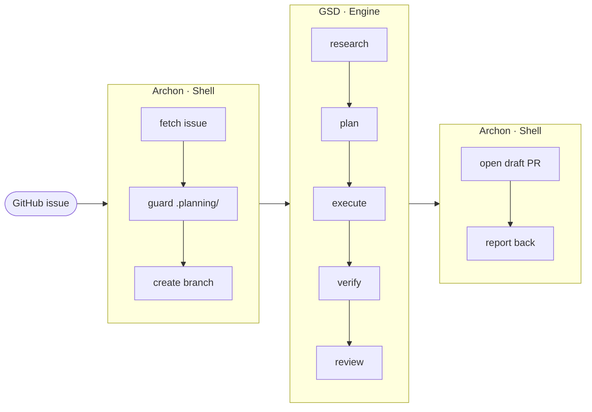

# archon-gsd

Re-points Archon's `archon-fix-github-issue` workflow so **Archon is a thin Shell**
(trigger the run, open the PR) and **GSD is the Engine** (research, plan, execute,
verify, review). None of Archon's native investigate / plan / implement / validate
/ review nodes run.



The Shell owns routing: a classify node picks small vs. large and calls the GSD
command (`/gsd-quick` or `/gsd-phase`) directly. The Engine is baked into a custom
Archon image and seeded into the home volume on boot, so the Claude SDK resolves
those commands on every run.

See [CONTEXT.md](./CONTEXT.md) for the shared vocabulary and
[docs/adr/](./docs/adr/) for the runtime and deploy decisions.

## Add to an existing Archon setup

You run Archon from its own checkout. Three things must be in place: the Engine
baked into the image, the override workflow reachable, and each target repo prepared.

**1. Bake the Engine.** Copy these into your Archon checkout root (all gitignored
by Archon, so your copy stays local):

| from this repo | to Archon checkout |
|----------------|--------------------|
| `docker-compose.override.yml` | `docker-compose.override.yml` |
| `docker/Dockerfile.user` | `Dockerfile.user` |
| `docker/install-gsd-runtime.sh` | `install-gsd-runtime.sh` |
| `docker/gsd-seed-entrypoint.sh` | `gsd-seed-entrypoint.sh` |

```bash
docker compose -f docker-compose.yml build   # base `archon` image first
docker compose up -d --build                 # builds the GSD extension, runs the stack
```

`--build` is required, or compose runs the plain base without GSD.

**2. Reach target repos.** Place
[`.archon/workflows/archon-fix-github-issue.yaml`](./.archon/workflows/archon-fix-github-issue.yaml)
either container-global at `~/.archon/workflows/` (all repos inherit it) or per-repo
under each target's `.archon/workflows/`.

**3. Prepare each target repo.** Commit `.planning/config.json`, `STATE.md`, and
`ROADMAP.md` with the [headless config](./docs/headless-config.md) keys set — the
`guard-planning` node fails fast without them and never bootstraps.

Verify the baked runtime, then drive the full path per [docs/e2e-run.md](./docs/e2e-run.md):

```bash
docker build -f docker/Dockerfile.smoke -t archon-gsd-smoke . && docker run --rm archon-gsd-smoke
```
